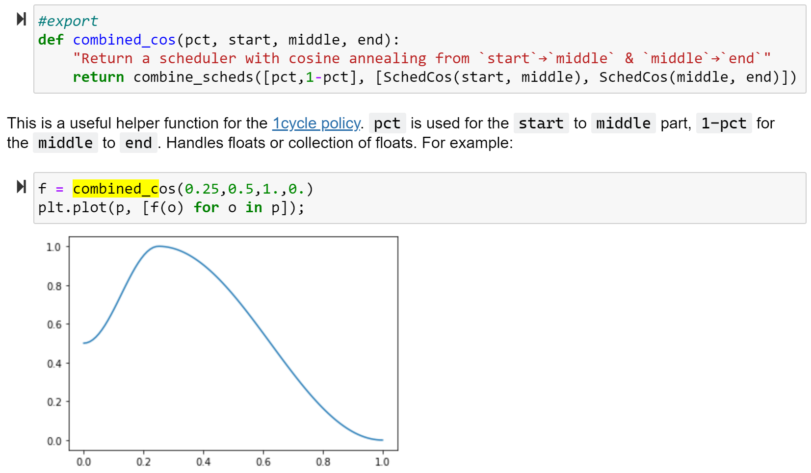
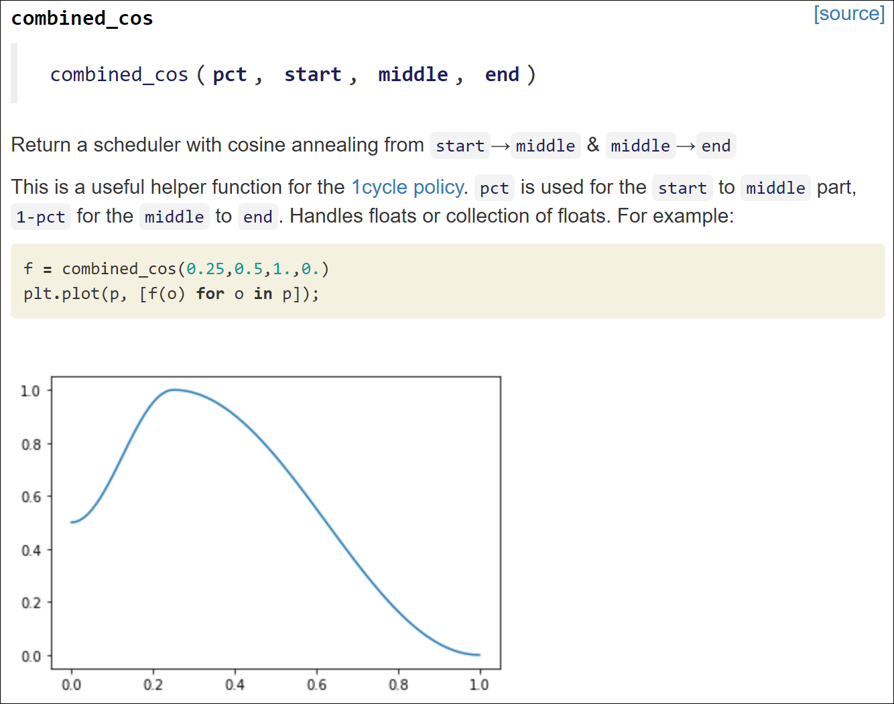

# Welcome to nbdev


`nbdev` is a library that allows you to fully develop a library in [jupyter notebooks](https://jupyter.org/), putting all your code, tests and documentation in one place. Using the interactive enviromnent, you can easily debug and refactor your code. By simply adding `#export` flags to the cells that define the functions you want to keep, you can then convert your notebook in a standard python module with just one command in the console or one line of code at the end of your notebook:



Here the function `add_init` is defined in the first cell (marked with the export flag) and tested in the second cell. In the last cell of your notebook, you can then run:
<div class="codecell" markdown="1">
<div class="input_area" markdown="1">

```python
from nbdev.export import *
notebook2script()
```

</div>
<div class="output_area" markdown="1">

    Converted 00_export.ipynb.
    Converted 01_sync.ipynb.
    Converted 02_showdoc.ipynb.
    Converted 03_export2html.ipynb.
    Converted 04_test.ipynb.
    Converted 05_cli.ipynb.
    Converted 99_index.ipynb.


</div>

</div>

Or in the command line, you can run:
``` bash
nbdev_build_lib
```
as long as you are somewhere in the folder where you are developing your library.

Since you are in a notebook, you can also add text, links or images that will be kept along with the tests when you generate the documentation of your library. The cells where your code is defined will be hidden and replaced by a satandard documentation of your function, showing its name, arguments, docstring, and link to the source code on github. For instance, the cells before are converted to:


